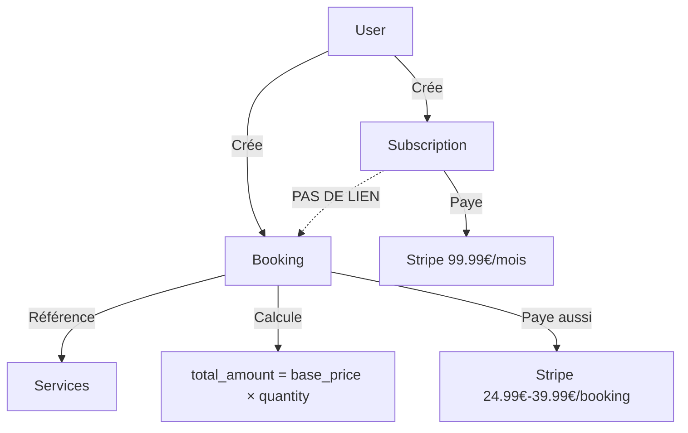

# 📊 Réponses Rapides : Abonnements & Réservations

> **Analyse basée sur le code réel, pas sur la documentation**  
> **Date**: 5 octobre 2025

---

## ❓ Question 1: Dois-je payer pour les réservations avec un abonnement monthly (99,99€/mois) ?

### 🔴 **OUI, vous payez pour CHAQUE réservation**

**Preuve dans le code** (`app/api/bookings/route.ts`, ligne 68-88):

```typescript
// Calculate total amount
let totalAmount = 0
for (const item of validatedData.items) {
  const service = services.find((s) => s.id === item.serviceId)
  if (service) {
    totalAmount += service.base_price * item.quantity
  }
}

// Puis insertion avec payment_status: "pending"
await supabase.from("bookings").insert({
  total_amount: totalAmount,
  payment_status: "pending",  // 🚨 Paiement requis !
})
```

**Aucune vérification d'abonnement actif n'est faite** ❌

---

## ❓ Question 2: Quelle fréquence de réservation puis-je effectuer ?

### 🟢 **ILLIMITÉE actuellement (mais pas intentionnel)**

**Ce qui est annoncé** (dans `subscription_plans.metadata`):
- Plan mensuel : `"collections_per_week": 2`
- Plan trimestriel : `"collections_per_week": 3`

**Ce qui est implémenté**:
```typescript
// app/api/bookings/route.ts - Aucune vérification de quota !
// Pas de:
// - Comptage des réservations par semaine
// - Vérification du nombre de collectes utilisées
// - Blocage si quota dépassé
```

**Vous pouvez réserver autant que vous voulez** ✅ (bug/feature non finalisée)

---

## ❓ Question 3: Quelle différence entre réserver avec/sans abonnement ?

### 🟡 **AUCUNE DIFFÉRENCE dans l'implémentation actuelle**

| Critère | Sans Abonnement | Avec Abonnement (99,99€/mois) |
|---------|-----------------|-------------------------------|
| **Prix des services** | 24,99€ - 39,99€ | **Identique** ❌ |
| **Paiement requis** | Oui | **Oui** ❌ |
| **Limitation de fréquence** | Non | **Non** ❌ |
| **Tarifs préférentiels** | Non | **Non (promis mais pas implémenté)** ❌ |
| **Priorité créneaux** | Non | **Non (pas de système)** ❌ |
| **Badge "Abonné"** | Non | **Oui** ✅ (cosmétique) |

---

## 🎯 L'Abonnement Actuel Sert À Quoi ?

### Ce que vous OBTENEZ :
✅ **Paiement mensuel/trimestriel de l'abonnement via Stripe**  
✅ **Badge "Abonnement Actif" dans le dashboard**  
✅ **Stocké dans la table `subscriptions`**

### Ce que vous N'OBTENEZ PAS :
❌ **Réductions sur les réservations**  
❌ **Services inclus/gratuits**  
❌ **Limite de collectes respectée**  
❌ **Tarifs préférentiels**  
❌ **Priorité réelle sur les créneaux**

---

## 📊 Structure de Données Actuelle



**Problème**: Les deux systèmes de paiement sont **déconnectés** !

---

## 🚨 Incohérence Majeure

### Frontend dit :
```tsx
// components/booking/summary-step.tsx, ligne 356
{serviceType === "classic" ? (
  <>{getTotalPrice().toFixed(2)}€</>
) : (
  <span className="text-green-600">Inclus dans l'abonnement</span>
)}
```

### Backend fait :
```typescript
// app/api/bookings/route.ts, ligne 118
await supabase.from("bookings").insert({
  total_amount: totalAmount,      // Montant calculé
  payment_status: "pending",      // Paiement attendu
  // Aucune exemption pour les abonnés !
})
```

**Résultat** : L'utilisateur croit que c'est gratuit mais sera facturé ! 🚨

---

## 💰 Exemple Concret

### Scénario : Utilisateur avec abonnement mensuel (99,99€/mois)

**Mois 1** :
- Paye 99,99€ d'abonnement ✅
- Réserve "Nettoyage + pliage" (24,99€) → **Facturé 24,99€** ❌
- Réserve "Nettoyage + repassage" (29,99€) → **Facturé 29,99€** ❌
- **Total dépensé : 154,97€** au lieu de 99,99€

**Vs Sans Abonnement** :
- Pas d'abonnement : 0€
- Réserve "Nettoyage + pliage" (24,99€) → Facturé 24,99€
- Réserve "Nettoyage + repassage" (29,99€) → Facturé 29,99€
- **Total dépensé : 54,98€**

**Conclusion** : Avoir un abonnement coûte PLUS CHER actuellement ! 🤯

---

## 🔧 Que Faire ?

### Option A : Implémenter les promesses
1. ✅ Ajouter `subscription_id` dans `bookings`
2. ✅ Vérifier l'abonnement actif lors du booking
3. ✅ Appliquer tarif réduit ou exempter de paiement
4. ✅ Compter et limiter les collectes par semaine

### Option B : Clarifier l'offre
1. ✅ Modifier l'UI pour dire "Tarif réduit" au lieu de "Inclus"
2. ✅ Documenter clairement que les services sont payants
3. ✅ Expliquer les vrais avantages (s'il y en a)

### Option C : Désactiver temporairement
1. ✅ Masquer les abonnements jusqu'à implémentation complète
2. ✅ Proposer uniquement les services à la carte

---

## 📄 Documents Créés

1. **Analyse complète** : `docs/ANALYSIS_SUBSCRIPTION_BOOKING_RELATIONSHIP.md`
2. **Script SQL d'analyse** : `scripts/analyze_subscription_booking_relationship.sql`
3. **Ce résumé** : `docs/QUICK_ANSWERS_SUBSCRIPTION_BOOKING.md`

---

## 🎬 Prochaines Actions Recommandées

1. **Décision Business** : Clarifier ce que l'abonnement doit vraiment offrir
2. **PRD Technique** : Créer un PRD complet pour la fonctionnalité
3. **Implémentation** : Développer la logique backend manquante
4. **Tests** : Valider tous les scénarios (avec/sans abonnement)
5. **Mise à jour docs** : Aligner toute la documentation

---

**Pour toute question, référez-vous à l'analyse complète dans `docs/ANALYSIS_SUBSCRIPTION_BOOKING_RELATIONSHIP.md`**
