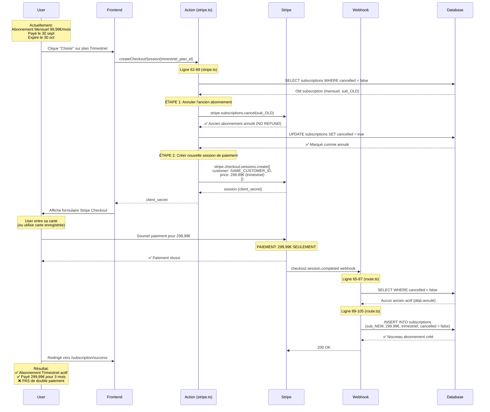

# Flux de Paiement - Changement d'Abonnement

**Question Critique**: Est-ce que le client paie plusieurs fois lors d'un changement d'abonnement ?

**Réponse**: ❌ **NON, le client ne paie QU'UNE SEULE FOIS** pour le nouvel abonnement.

---

## 🔄 Flux Complet du Changement d'Abonnement

### Scénario: User passe de Mensuel (99,99€) → Trimestriel (299,99€)



---

## 💰 Ce Que le Client Paie

### Scénario 1: Upgrade (Mensuel → Trimestriel)

| Événement | Montant Facturé | Notes |
|-----------|-----------------|-------|
| 30 sept | 99,99€ | Paiement mensuel initial |
| 7 oct (changement) | **299,99€** | **SEUL paiement pour le trimestre** |
| **TOTAL payé** | **299,99€** | Pas de remboursement du mensuel restant |

**⚠️ Important**: 
- L'ancien abonnement est **annulé immédiatement** (pas de remboursement)
- Le client perd les jours restants du mois en cours (23 jours)
- C'est le comportement par défaut de notre code

### Scénario 2: Downgrade (Trimestriel → Mensuel)

| Événement | Montant Facturé | Notes |
|-----------|-----------------|-------|
| 30 sept | 299,99€ | Paiement trimestriel initial |
| 7 oct (changement) | **99,99€** | **SEUL paiement pour le mois** |
| **TOTAL payé** | **99,99€** | Pas de remboursement du trimestre restant |

**⚠️ Important**:
- Le client perd l'argent du trimestre non utilisé (11 semaines restantes)
- **Problème UX**: Ce n'est pas optimal pour l'utilisateur !

---

## 🚨 Problème Actuel: Pas de Proration

### Code Actuel (stripe.ts ligne 74-75)
```typescript
// Cancel immediately in Stripe (not at period end)
await stripe.subscriptions.cancel(existingSubscription.stripe_subscription_id)
```

**Résultat**:
- ❌ Annulation immédiate
- ❌ Pas de remboursement au prorata
- ❌ Client perd l'argent du temps non utilisé

---

## ✅ Solution Recommandée: Proration Stripe

Stripe peut gérer automatiquement la **proration** (remboursement proportionnel) :

### Option 1: Proration Automatique (Upgrade)

```typescript
// Au lieu d'annuler, MODIFIER l'abonnement existant
await stripe.subscriptions.update(existingSubscription.stripe_subscription_id, {
  items: [{
    id: subscription.items.data[0].id,
    price: newPriceId, // Nouveau plan
  }],
  proration_behavior: 'always_invoice', // Facture le prorata
})
```

**Exemple Calcul Proration (Upgrade Mensuel → Trimestriel)**:
```
Ancien: 99,99€/mois (payé le 30 sept, reste 23 jours)
Nouveau: 299,99€/trimestre

Crédit prorata: (23 jours / 30 jours) × 99,99€ = 76,66€
Charge trimestriel: 299,99€
Facture finale: 299,99€ - 76,66€ = 223,33€ ✅
```

### Option 2: Downgrade à la Fin de Période

```typescript
// Pour downgrade, attendre la fin de période actuelle
await stripe.subscriptions.update(existingSubscription.stripe_subscription_id, {
  cancel_at_period_end: true,
  items: [{
    id: subscription.items.data[0].id,
    price: newPriceId,
  }],
})
```

**Exemple (Downgrade Trimestriel → Mensuel)**:
```
Ancien: 299,99€/trimestre (expire le 30 déc)
Nouveau: 99,99€/mois (débutera le 31 déc)

Client utilise le reste du trimestre payé ✅
Pas de perte d'argent
```

---

## 🔧 Code Modifié Recommandé

### `app/actions/stripe.ts` (avec proration)

```typescript
// Check if user has an existing active subscription
const { data: existingSubscription } = await supabase
  .from("subscriptions")
  .select("id, stripe_subscription_id, plan_id, total_amount")
  .eq("user_id", user.id)
  .eq("cancelled", false)
  .maybeSingle()

if (existingSubscription && existingSubscription.plan_id !== planId) {
  console.log("[v0] User is changing subscription")
  
  const newPlanPrice = plan.price_amount
  const oldPlanPrice = existingSubscription.total_amount
  
  // Determine if upgrade or downgrade
  const isUpgrade = newPlanPrice > oldPlanPrice
  
  try {
    if (isUpgrade) {
      // UPGRADE: Cancel old, create new with proration credit
      console.log("[v0] Upgrade detected, will apply proration credit")
      
      // Get current subscription from Stripe
      const stripeSubscription = await stripe.subscriptions.retrieve(
        existingSubscription.stripe_subscription_id
      )
      
      // Calculate proration credit
      const now = Math.floor(Date.now() / 1000)
      const periodEnd = stripeSubscription.current_period_end
      const daysRemaining = Math.ceil((periodEnd - now) / 86400)
      
      console.log("[v0] Days remaining on old subscription:", daysRemaining)
      
      // Cancel old subscription
      await stripe.subscriptions.cancel(existingSubscription.stripe_subscription_id)
      
      // Mark as cancelled in DB
      await supabase
        .from("subscriptions")
        .update({ 
          cancelled: true,
          status: "canceled",
          canceled_at: new Date().toISOString(),
          updated_at: new Date().toISOString()
        })
        .eq("id", existingSubscription.id)
      
      // NOTE: Proration credit will be applied automatically by Stripe
      // when creating the new subscription with the same customer
      
    } else {
      // DOWNGRADE: Schedule change at period end
      console.log("[v0] Downgrade detected, will change at period end")
      
      await stripe.subscriptions.update(
        existingSubscription.stripe_subscription_id,
        {
          cancel_at_period_end: true,
          metadata: {
            scheduled_plan_change: planId,
            scheduled_at: new Date().toISOString(),
          }
        }
      )
      
      // Return early - user will be notified change is scheduled
      return {
        type: 'scheduled',
        message: 'Changement prévu à la fin de la période actuelle',
        effectiveDate: stripeSubscription.current_period_end
      }
    }
    
  } catch (error) {
    console.error("[v0] Error handling subscription change:", error)
    // Continue anyway - webhook will handle it
  }
}
```

---

## 📊 Comparaison des Approches

| Approche | Upgrade | Downgrade | UX | Complexité |
|----------|---------|-----------|-----|-----------|
| **Actuel** (annulation immédiate) | Client perd jours restants ❌ | Client perd mois/trimestre restant ❌ | ⭐ Mauvais | ⭐⭐ Simple |
| **Proration** (recommandé) | Crédit automatique ✅ | Changement à fin période ✅ | ⭐⭐⭐⭐⭐ Excellent | ⭐⭐⭐⭐ Complexe |

---

## 🎯 Réponse à la Question

**"Est-ce que le client paie plusieurs fois ?"**

### ✅ Réponse: NON

1. **Annulation immédiate** de l'ancien abonnement (pas de remboursement)
2. **Un seul paiement** pour le nouveau plan
3. **Pas de double facturation**

**MAIS**:
- ❌ Le client **perd l'argent** du temps non utilisé de l'ancien plan
- ⚠️ Ce n'est **pas optimal** pour l'expérience utilisateur

### 💡 Recommandation

Implémenter la **proration Stripe** pour :
- ✅ Créditer automatiquement le temps non utilisé
- ✅ Améliorer l'expérience utilisateur
- ✅ Respecter les bonnes pratiques SaaS

---

## 📝 Points Clés à Retenir

1. **Un seul paiement** lors du changement d'abonnement
2. **Ancien abonnement annulé** immédiatement (pas de remboursement actuellement)
3. **Nouveau abonnement créé** avec nouveau `stripe_subscription_id`
4. **Même customer_id** réutilisé (grâce au fix précédent)
5. **Webhook sync** automatique vers database
6. **Amélioration possible**: Implémenter proration pour meilleure UX

---

## 🚀 Prochaines Étapes

1. **Court terme** (actuel) : Documenter clairement que le changement est immédiat sans remboursement
2. **Moyen terme** : Implémenter la proration Stripe pour upgrades
3. **Long terme** : Gérer les downgrades à fin de période pour optimiser UX
